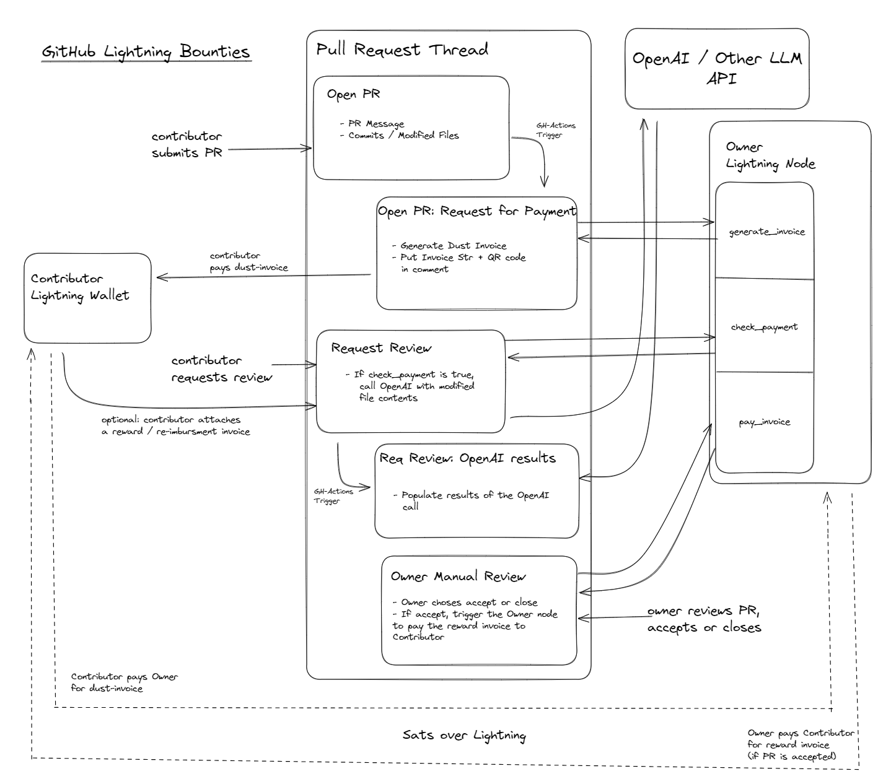

# Recruiting Readme

Do you want to join my team? (Will Sutton https://github.com/sutt)

### Logistics:
- Main site: https://mitbitcoin.devpost.com/
- Duration: Friday, April 19th, 6pm - Saturday, April 20th , Midnight
- Can be in-person or remote.

### Target Project: "GitHub Lightning Bounties"

We may want to use LLM's to evaluate incoming pull requests on a github repo. This could be for security analysis, code quality, or to detect missing items required in the PR. Github actions are a natural fit for this.

Unfortunately each call to the LLM API costs money. And if we get lots of spam pull requests, we could get stuck with a big bill.

We propose a system to use lightning payments to require a small payment for each PR to kickoff the call to the LLM's API. This will help us to filter out spam and also to cover the costs of the LLM API.

Additionally, we might not want to extract satoshis from these nice open-source developers who are contributing to our project. So we could also have a system to refund the payment if the PR is accepted, or even pay a larger amount back as a reward after the PR is merged.

<!-- add image -->

##### The Team Rewards Program
- Chance to learn / collaborate on:
    - github-actions
    - llm evals
    - lightning app development
- Lightning wallet with 10k satoshis (market value $7)
- OpenAI and Claude credits :)

##### Stack:
- Github Actions:
    - These allow both python and nodejs scripts
    - I'm still learning this.
- LNBits / LND:
    - I have a basic node running and can get this use case off the ground.
    - But I'm no expert and open to other solutions here.
-  Lime-Green:
    - a homebrewed python package for LLM evals.
- Bring your own setup:
    - I'm open to other tools and libraries.
    - And always need help from a good front-end dev / designer.

### Other Possible Projects:
 - Feel free to suggest!
